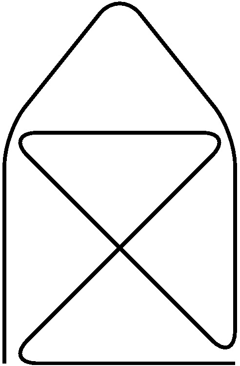

## Process enumerate

```latex
\begin{enumerate}
  \item Item One
  \item Item Two
\end{enumerate}
```

will produce

```md
1. Item One
2. Item Two
```

With nested enumerate:

```latex
\begin{enumerate}
  \item Item One
  \begin{enumerate}
    \item Subitem One
    \item Subitem two
  \end{enumerate}
  \item Item Two
\end{enumerate}
```

will produce:

```md
1. Item One
1. a) Subitem One
1. b) Subitem Two
2. Item Two
```

## Include pictures

```latex
\documentclass{article}
\usepackage{graphicx} 
\begin{document}
The universe is immense and it seems to be homogeneous, 
in a large scale, everywhere we look at.
 
\includegraphics{universe.png}
 
There's a picture of a galaxy above
\end{document}
```

```md
The universe is immense and it seems to be homogeneous, in a large
scale, everywhere we look at.


There's a picture of a galaxy above
```

## Working with TikZ or PsTricks

In `sample-tikz.tex`:

```latex
\documentclass{article}
\usepackage{tikz}
\begin{document}
  \begin{tikzpicture}
  \draw[thick,rounded corners=8pt] (0,0) -- (0,2) -- (1,3.25) 
   -- (2,2) -- (2,0) -- (0,2) -- (2,2) -- (0,0) -- (2,0);
  \end{tikzpicture}
\end{document}
```

will produce `sample-tikz.md` and `sample-tikz-0.jpg`

```md

```


