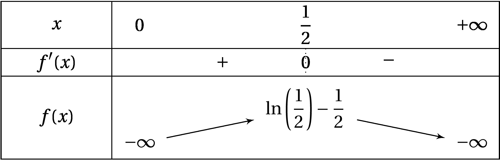

un truc la

:::exercice Exercice 1: Les bases /1.5 points

Simplifier les expressions suivantes:

$A=\frac{3-\ln(\text{e})}{\ln(9)}$\

$B=\frac{\ln(\text{e})}{\ln(e^2)}+ \ln\left(\frac{1}{e}\right)$\

$C=\frac{\ln(6)-\ln(12)}{2\ln(\sqrt{2})}$\

:::

:::exercice Exercice 2: Equations-Inéquations /6 points

Résoudre :

**1.** $2\ln(x)=\ln(2-x)$\

**2.** $2(\ln(x))^2+\ln(x)-1=0$\

**3.** $\ln(1-2x)-\ln(2)\leq \ln(x+1)+\ln(3)$\

**4.** Déterminer le plus petit entier $n$ tel que $0,85^n\leq 0,05$\

:::

:::exercice Exercice 3: Dérivation /2.5 points

Déterminer les fonctions dérivées des fonctions suivantes sur leur
ensemble de définition:

**1.** $f(x)=x+2\ln(x+2)$ sur $D_f=]-2;+\infty[$\

**2.** $h(x)=3(\ln(x))^2+2\ln(x)$ sur $D_h=]0;+\infty[$\

:::

:::exercice Exercice 4: Limites /5 points

Déterminer les limites suivantes:

**1.** $\Lim{x}{+\infty}{\ln(2+3e^x)}$\

**2.** $\Lim{x}{0^+}{\ln(2+3e^x)}$\

**3.** $\Lim{x}{+\infty}{(\ln(x))^2-3\ln(x)}$\

**4.** $\Lim{x}{0^+}{(\ln(x))^2-3\ln(x)}$\

:::

:::exercice Exercice 5: Logarithmes /7 points

On considère la fonction $f$ définie sur $]O;+\infty[$ par:
$f(x) = \ln(x)-2x^2$

**1.** Étudier les variations de $f$.\

:::startsolution

$f'(x)=\frac{1}{x}-4x=\frac{1-4x^2}{x}$

Comme $x \in ]0;+\infty[$, $f'(x)$ est du signe de
$1-4x^2=(1-2x)(1+2x)$.

Après le tableau de signes (à faire !),\

\
on en déduit que $f$ est strictement croissante sur $]0;\frac{1}{2}[$ et
strictement décroissante sur $]\frac{1}{2};+\infty[$.

:::endsolution

**2.** Déterminer les limites de $f$ en 0 et en $+\infty$. Que peut-on
en déduire ?\

:::startsolution

Aucune difficulté en 0. On trouve: $\lim_{x\to 0}f(x)=-\infty$.

On peut en déduire que l'axe des ordonnées est asymptote verticale à la
courbe.

En $+\infty$:

$f(x)=\ln(x) - 2x^2 = x\left(\frac{\ln(x)}{x} -2x\right)$ et on utilise
$\lim_{x\to +\infty} \frac{\ln(x)}{x} =0$.

On trouve $\lim_{x\to +\infty}f(x)=-\infty$

:::endsolution

**3.** Dresser le tableau de variations de $f$.\

:::startsolution

:::endsolution

**4.** Quel est le signe de $f$ sur $]0;+\infty[$ ? Justifier.\

:::startsolution

Le maximum sur $]0;+\infty[$ est
$\ln\left(\frac{1}{2}\right)-\frac{1}{2} \approx -1,2$ on en déduit :
$\forall x \in ]0;+\infty[ : f(x) <0$

:::endsolution

**5.** Démontrer que l'équation $f(x)=-2$ admet exactement deux solution
$\alpha$ et $\beta$ sur $]0;+\infty[$. En donner une valeur approchée
arrondie à $10^{-3}$ près.\

:::startsolution

-   Sur l'intervalle $\left] 0; \frac{1}{2}\right ]$ la fonction $f$ est
    continue (car dérivable) et est strictement croissante à valeurs
    dans
    $\left]-\infty;\ln\left(\frac{1}{2}\right)-\frac{1}{2} \right]$\
    $-2 \in \left]-\infty; \ln(\frac{1}{2})-\frac{1}{2} \right]$ , alors
    d'après le corolaire du théorème des valeurs intermédiaires :
    l'équation $f(x)=-2$ admet une unique solution $\alpha$ sur
    $\left]0;\frac{1}{2} \right]$ .\
    On a de plus $0,1408 <\alpha <0,1409$ donc $\alpha \approx 0,141$ à
    $10^{-3}$ près

-   Sur l'intervalle $\left] \frac{1}{2}; +\infty \right[$ la fonction
    $f$ est continue (car dérivable) et est strictement décroissante à
    valeurs dans $\left]-\infty; \ln(\frac{1}{2})-\frac{1}{2} \right]$\
    $-2 \in \left]-\infty; \ln(\frac{1}{2})-\frac{1}{2} \right]$ , alors
    d'après le corolaire du théorème des valeurs intermédiaires :
    l'équation $f(x)=-2$ admet une unique solution $\beta$ sur
    $\left] \frac{1}{2}; +\infty \right[$ .\
    On a de plus $\beta =1$

:::endsolution

:::